# 타임폴리오 대회용 Dashboard

KOSPI·KOSDAQ 개별종목 모의투자대회(수익률·샤프지수 평가)를 운용역처럼 관리하기 위한 **Excel 일일 대시보드**입니다.
한국투자증권(KIS) Open API를 Excel Power Query가 직접 조회하고, 파이썬 빌더가 Excel COM으로 통합문서 `KIS_PM_Dashboard.xlsm`(VBA 버튼 포함)을 만들거나 다시 만듭니다.

- **조회 전용** — 주문·정정·취소·계좌 API는 쓰지 않습니다.
- 대회 종목 약 530개를 한눈에 보는 [대회종목], KRX 업종·테마 시세의 [업종], 한 종목을 깊게 보는 [종목분석], 이벤트·뉴스의 [뉴스·이벤트] 페이지와 [대시보드]·[시장]·[포트폴리오]·[리스크]·[성과]·[시세판]·[매매일지] 시트가 있습니다.
- 사용 방법·버튼·매일 루틴·문제 해결은 **[excel_dashboard/README.md](excel_dashboard/README.md)** 에 있습니다.

## 화면과 기능

> 아래 화면은 실제 통합문서를 캡처한 것입니다(데이터 기준 2026-10-02 03:10·대회 D+21, [종목분석]은 2026-10-09 조회, Excel 확대/축소 55%).
> 이미지를 누르면 원본 크기로 볼 수 있습니다.

### 대시보드 — 하루를 여는 첫 화면

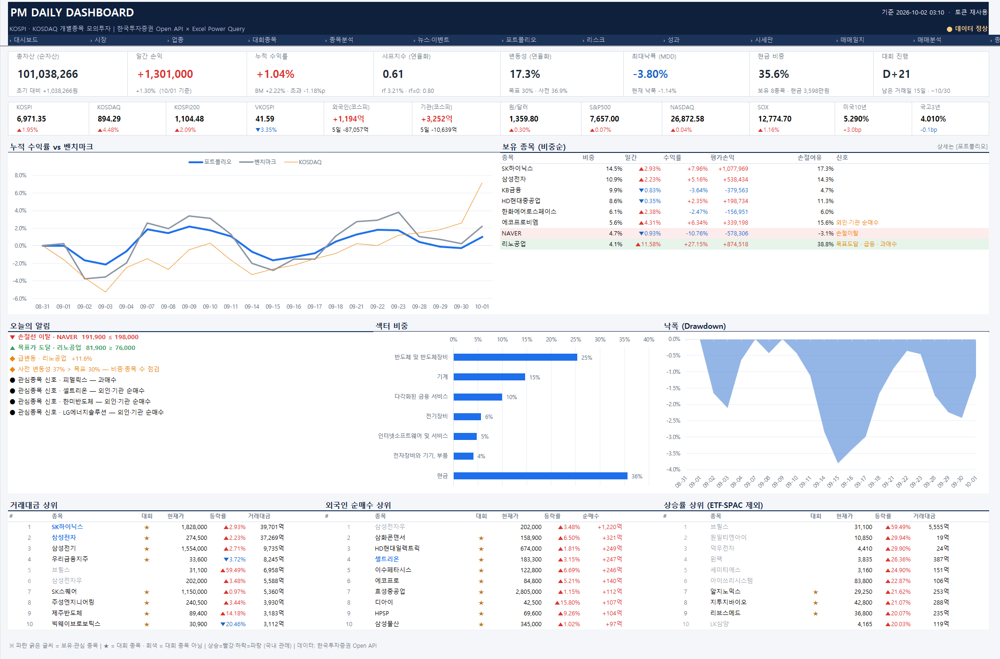

- **KPI 8개**: 순자산, 일간 손익, 누적 수익률(벤치마크 대비 초과), 샤프지수(연율), 변동성, 최대낙폭(MDD), 현금 비중, 대회 진행(D+n·남은 거래일)
- **시장 스트립**: KOSPI·KOSDAQ·KOSPI200·VKOSPI, 외국인·기관 순매수, 원/달러, S&P500·NASDAQ·SOX, 미국 10년·국고 3년
- 누적 수익률 vs 벤치마크 차트, **보유 종목**(비중·수익률·손절여유·신호), **오늘의 알림**(손절선 이탈·목표가 도달·급변동·변동성 초과·관심종목 수급 신호), 섹터 비중, 낙폭 차트
- 거래대금·외국인 순매수·상승률 **상위 10**(★ = 대회 종목, 파란 굵은 글씨 = 보유·관심)

### 시장 — 지수·수급·업종·해외

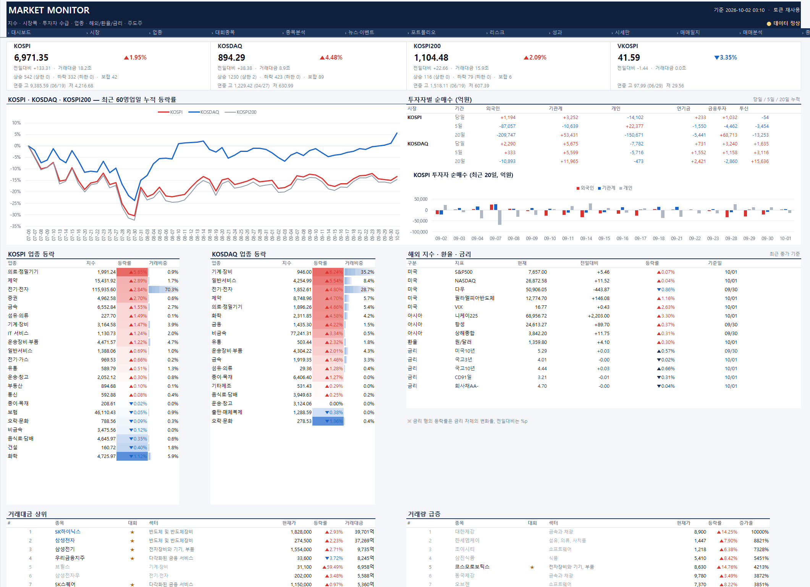

- 지수 카드(상승·하락·보합 종목 수, 연중 고저), 최근 60영업일 누적 등락, 투자자별 순매수(당일·5일·20일)와 20일 차트
- KOSPI·KOSDAQ 업종 등락 히트맵, 해외 지수·환율·금리, 주도주 순위 6종(거래대금·거래량 급증 등), 증시 자금 동향(고객예탁금·신용융자·MMF 등)

### 업종 — KRX 업종지수와 테마 집계 ([업종] 버튼)

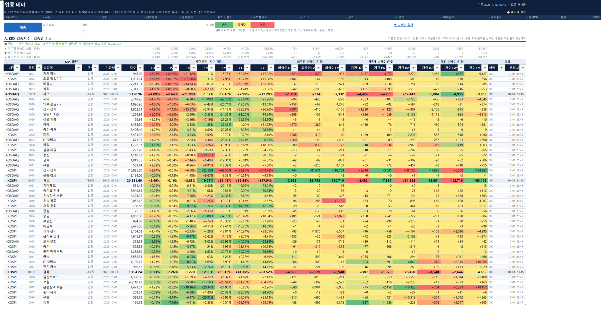

- **A. KRX 업종지수**(KOSPI 24·KOSDAQ 22): 1D~1Y 기간 등락, 외국인·기관·개인 순매수(1D·1W·1M)
- **B. 테마 집계**: 대테마·세부테마별 시총가중 등락, 상승 종목 비율, 수급
- 열마다 Q.Pack식 3색 척도(초록 낮음 → 노랑 → 빨강 높음)로 상대 위치를 한눈에

### 대회종목 — 대회 종목 527개를 한 표로 ([시세]·[전체] 버튼)

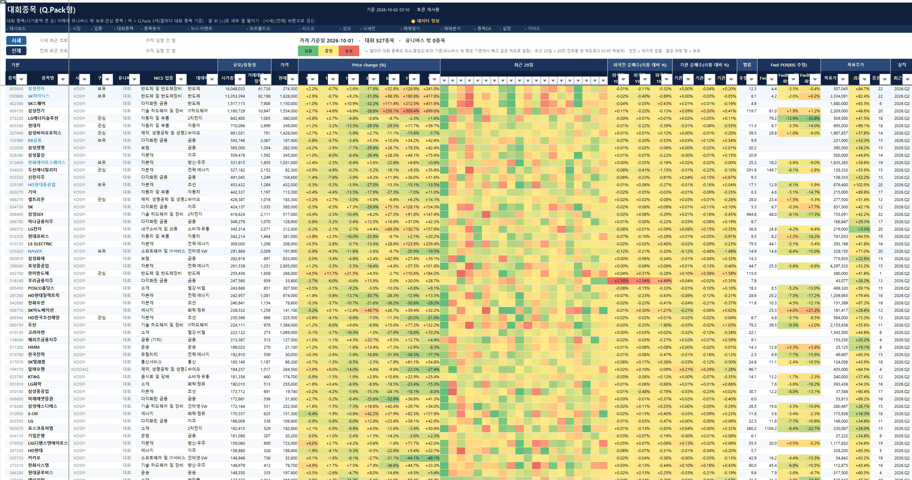

- 대회 규칙(9/30 시가총액 1,000억 이상 & 5일 평균 거래대금 25억 이상 보통주)으로 고정한 527종목 + 대회 밖 보유·관심 종목, 103열
- 가격 변화 1D~1Y, **최근 20일 줄무늬**, 외국인·기관 순매수(시총 대비 %), 후행·Fwd PER과 변화, 목표주가 컨센서스·괴리율, 분기 실적, 신용·공매도·대차, 다음 이벤트, NICS 업종·테마
- 색 기준점은 대회 종목만으로 계산하고, 세부 열은 +/− 묶음으로 접어 둠
- [시세]는 현재가와 마지막 세션만(약 30초), [전체]는 분류·수급·목표주가·추정·이벤트까지 갱신(평일 약 4~5분)

### 종목분석 — 한 종목을 깊게 ([조회] 버튼)

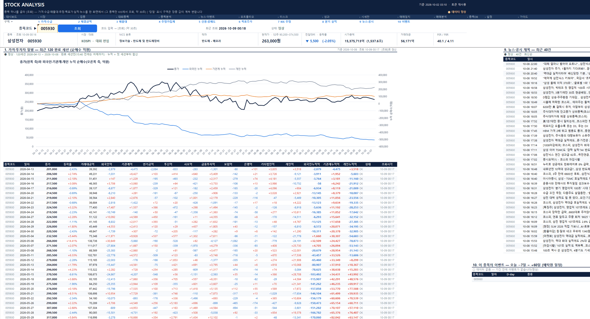

- 종목코드를 넣고 [조회]를 누르면 그 종목만 13개 구역을 한 번에 조회합니다(약 1분, 화면은 삼성전자).
- 상단 요약(시장·대회 편입·NICS 분류·테마·현재가·52주 범위·시가총액·PER/PBR)과 구역 바로가기 1~10
- 120세션 가격과 외국인·기관계·개인 누적 순매수 차트·일별 표, 뉴스·공시 제목 40건, 이 종목의 이벤트(−7일 ~ +60일)
- 오른쪽·아래 구역: 체결금액별 매매비중, 매물대, 외인·기관 추정가집계, 신용·공매도·대차 60세션, 증권사별 목표가·월말 컨센서스, KIS 추정, 8분기 실적

### 뉴스·이벤트

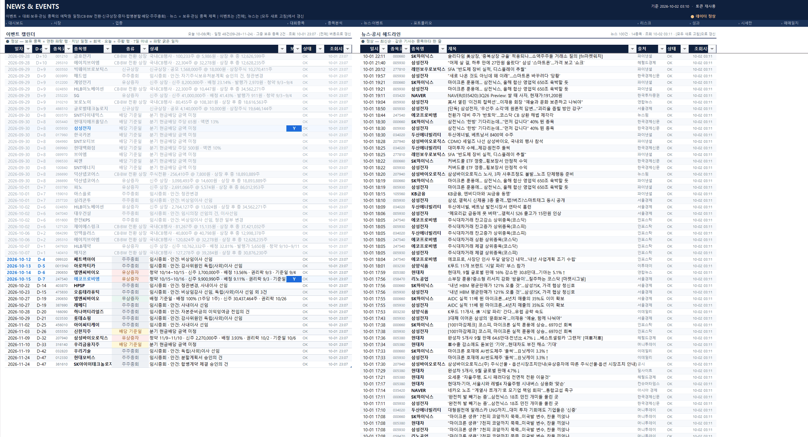

- **이벤트 캘린더**(−7일 ~ +60일): CB·BW 전환 상장, 신규상장, 유·무상증자, 합병·분할, 배당 기준일, 주주총회 — 보유 종목 강조, D-day 표시
- 보유·관심 종목 **뉴스·공시 제목** 최근 100건

### 포트폴리오 · 리스크 · 성과

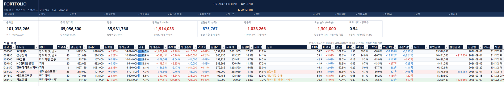

- **포트폴리오**: 순자산·주식 평가액·현금·평가손익·실현손익·포트 베타, 보유 종목별 평균단가·평가손익·기여도·손절가/목표가·여유, 기술지표(RSI·이격도)·위험기여·외인/기관 5일 수급·신호

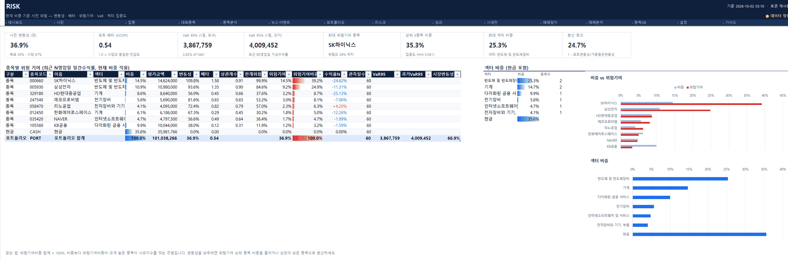

- **리스크**: 사전 변동성, 포트 베타, VaR 95%(1일, 모수·과거), 최대 위험기여 종목, 상위 3종목·최대 섹터 비중, 분산 효과, 종목별 위험기여(비중 대비)와 섹터 집중도

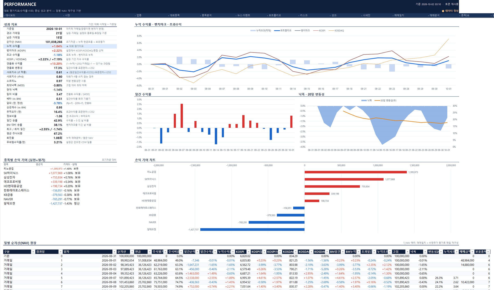

- **성과**: 대회 지표 27종(누적·초과 수익률, 샤프·소르티노·칼마, 변동성, MDD, 알파·베타, 정보비율, 일간 승률 등), 누적 수익률·벤치마크·초과수익 차트, 일간 수익률, 낙폭·20일 변동성, 종목별 손익 기여, 일별 NAV 원장

### 시세판 — 보유·관심 종목 장중 감시

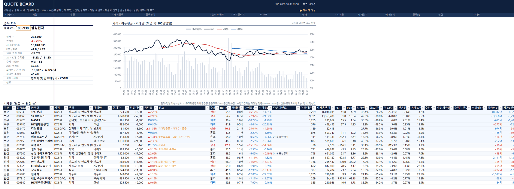

- 선택 종목의 가격·이동평균·거래량 차트(최근 100영업일)
- 보유·관심 종목의 시세·밸류·52주 위치·수급·신호, 대테마, 외인·기관 추정가집계(장중), 신용잔고율, 공매도 비중, 다음 이벤트

### 매매일지 · 매매분석

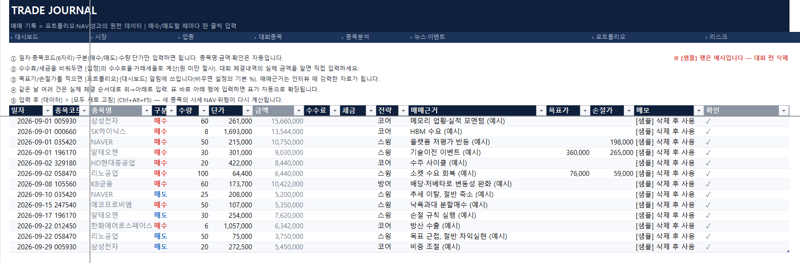

- **매매일지**: 대시보드의 **유일한 입력표**. 체결 한 줄(일자·종목·매수/매도·수량·단가·매매근거)을 적으면 보유·NAV·성과가 모두 다시 계산됩니다. 대회 종목이 아니면 `⚠ 대회 종목 아님` 표시(화면의 행은 빌더가 넣은 예시)

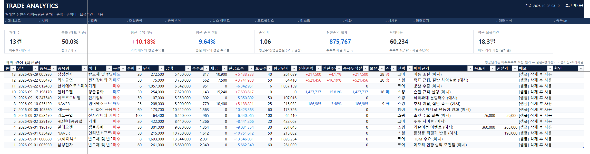

- **매매분석**: 거래별 실현손익(이동평균 원가), 승률, 평균 수익·손실, 손익비, 거래비용, 평균 보유기간

### 종목DB — 전체 유니버스와 분류

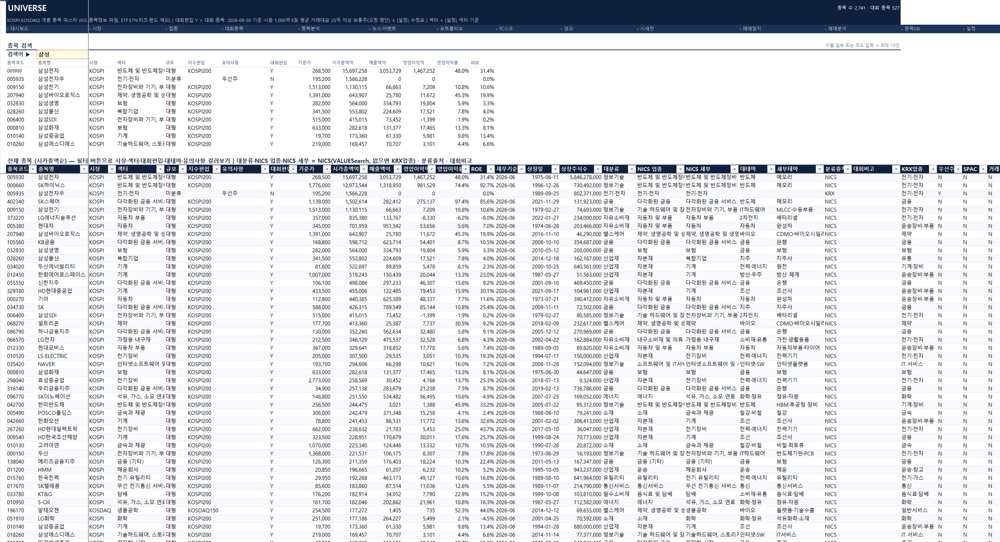

- KOSPI·KOSDAQ 개별종목 전체에 대회편입(Y/N), 섹터, NICS 대분류·업종·세부(VALUESearch), 대테마·세부테마, KRX 업종, 분류 출처를 붙인 기준표
- 분류를 바꾸고 싶으면 [설정]의 **수정표**에 종목코드와 바꿀 칸만 적습니다

이 밖에 [설정](대회 기간·초기자금·수수료·벤치마크·관심종목·수정표)과 [가이드](처음 설정·매일 루틴·지표 정의·문제 해결) 시트가 있습니다.

## 저장소 구성

```
.
├── README.md                  # 이 파일
├── excel_dashboard/           # 대시보드 전체(빌더·Power Query·VBA·페이지·도구·문서)
│   ├── README.md              # 사용자 안내(준비·빌드·버튼·지표·문제 해결)
│   ├── CLAUDE.md / AGENTS.md  # 개발 안내(AI 코딩 도구용)
│   ├── docs/                  # 구조·업무 규칙·보안·표준·운영·계약 문서
│   ├── build_dashboard.py     # 통합문서 생성기
│   ├── powerquery/*.pq        # Power Query(M) 원본
│   ├── vba/  pages/  tools/  data/
│   └── KIS_PM_Dashboard.xlsm  # 생성된 통합문서 — git 제외(토큰 캐시·매매기록)
└── 수집기업_valuesearch.xlsx   # NICS 업종 분류 원천(VALUESearch 내보내기)
```

## 준비

1. Windows + Microsoft 365 Excel(한국어판에서 검증).
2. KIS Developers에서 **실전투자** 앱키를 발급받고 아래 [KIS 설정 파일](#kis-설정-파일)을 만듭니다.
3. 통합문서를 (다시) 만들 때만 Python 3.11+와 패키지가 필요합니다.

```powershell
pip install pywin32 pyyaml requests
python excel_dashboard/build_dashboard.py   # 기존 통합문서가 있으면 자동 이관 후 다시 만듦(약 8~9분)
```

통합문서를 다른 PC로 옮겨 쓰는 방법과 빌드 옵션은 [excel_dashboard/README.md](excel_dashboard/README.md) 2~3절을 보세요.

### KIS 설정 파일

앱키·시크릿은 통합문서에 저장하지 않고 Power Query가 `~/KIS/config/kis_devlp.yaml`(Windows: `%USERPROFILE%\KIS\config\kis_devlp.yaml`)을 직접 읽습니다.
필수 항목은 `my_app`·`my_sec`·`prod` 세 개입니다(KIS 공식 샘플코드와 같은 형식이라 이미 쓰던 파일이 있으면 그대로 됩니다).

```yaml
# 실전투자 앱키·시크릿 (시세·순위·수급 API는 실전 도메인에서만 조회)
my_app: "실전투자 앱키"
my_sec: "실전투자 앱시크릿"

# 실전 REST 도메인
prod: "https://openapi.koreainvestment.com:9443"
```

- 이 파일은 **git에 넣지 않습니다.** 저장소 루트에 같은 이름의 파일을 두더라도 `.gitignore`가 막습니다.
- 경로를 바꾸려면 통합문서 [설정] 시트의 `cfg_path`를 고치거나 빌드할 때 `--cfg <경로>`를 줍니다.
